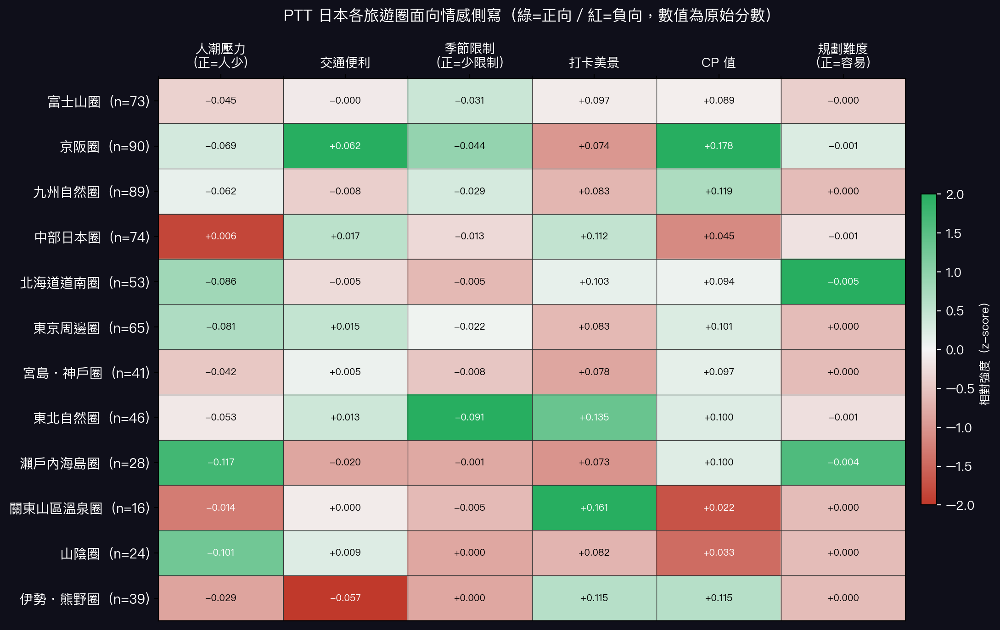

# 社群旅遊語料的行程結構分析與隱藏景點識別：以 PTT Japan 板為例

**Travel Pattern Analysis and Hidden Spot Identification from Community Travel Corpora: A Case Study of PTT Japan Board**

Social Media Analytics | Spring 2026

---

## 摘要

本研究提出兩項主要發現。其一，PTT 日本旅遊行程呈現高度結構化的地理迴路（Louvain Q=0.8775，18 個主要群集），各群集在人潮、交通、季節限制、打卡美景、CP 值與規劃難度等體驗維度上具有明顯差異。其二，在日本這個高度成熟的旅遊市場，以「Google Maps 低評論數」為隱藏景點的主要操作定義，輔以 KKday 商業曝光資料作為延伸佐證，最終識別出 **17 個真正的隱藏版景點**，平均 Google Maps 評論數僅 806 則，遠低於主流景點的數萬則，且 17 個景點同時缺席 KKday 所有商業產品。此一結果揭示：在成熟旅遊市場中，商業平台的盲點雖然存在但極為罕見，社群口碑的獨特價值在於挖掘這些規模雖小、卻具真實體驗深度的在地景點。

---

## 1. 研究動機與問題

隨著旅遊社群平台與論壇的普及，使用者生成內容（User-Generated Content, UGC）已成為旅遊資訊研究的重要資料來源（Buhalis & Law, 2008）。研究指出，旅遊者在規劃行程時，社群媒體的參考比重持續上升，其所提供的同儕口碑有別於商業廣告的推薦邏輯（Xiang & Gretzel, 2010）。KKday、Klook 等旅遊商業平台的推薦邏輯以流量與可商品化為核心，自然傾向將資源集中在少數熱門景點。與此同時，Google Maps 評論數反映的是廣泛大眾的到訪紀錄，兩者共同構成旅遊目的地的「主流曝光」。社群旅遊者真正欣賞的景點，未必能同時進入商業平台的選品視野與大眾的踩點範疇——尤其在日本這個商業開發高度飽和的市場，這類雙重盲點若存在，規模必然極為有限，但其成因值得系統性探究。

PTT Japan 板作為台灣最大的日本自助旅遊討論社群，累積了大量非商業導向的真實旅遊經驗，提供了一個獨立於商業邏輯之外的景點評價來源。本研究的核心問題是：**社群旅遊語料是否能有效識別商業平台與大眾雙重曝光不足的在地景點？在日本這個成熟旅遊市場，此類景點的存在規模與成因為何？**

為了回答這個問題，我們依序提出兩個子問題：

| | 問題 | 目的 |
|---|------|------|
| **RQ1** | PTT 日本景點共現網絡中有哪些隱性行程群集？各群集的體驗側寫有何差異？ | 建立主流行程結構，作為識別「主流之外」景點的對照基準 |
| **RQ2** | PTT 高評價景點中，有多少同時呈現 Google Maps 低評論數與 KKday 商業缺席？其結構性成因為何？ | 識別雙重曝光不足的在地景點，並解釋成因 |

兩個 RQ 形成遞進關係：RQ1 描繪主流行程的結構版圖，RQ2 在此版圖之外，回答核心問題中關於「規模」（有多少）與「成因」（為什麼）的兩個面向。

---

## 2. 資料與方法

### 2.1 資料收集

透過自製爬蟲抓取 PTT Japan 板全部文章，篩選標題含 `[遊記]`、`[心得]`、`[分享]` 標籤的旅遊文章，共取得 **5,409 篇**有效遊記（總文章 20,487 篇）。

### 2.2 地名擷取（NER）

使用 **Gemma 3 4B**（經 Ollama 本地部署）對每篇遊記進行景點名稱抽取。相較於以中文序列標記為主的傳統 NER 模型（如 CKIP Transformers），Gemma 3 4B 對日本景點名稱的識別能力更強——PTT 遊記中的日本地名多以繁體中文音譯或意譯呈現，而 CKIP 的 `LOC` 標籤訓練語料缺乏此類表達，誤判率高。

採用 prompt-based 抽取方式：以指令明確定義應抽取的景點類型（神社、寺廟、自然景觀、人文景點等）及應排除的類別（行政區、車站、餐廳、購物場所等），模型輸出 JSON 陣列後再經關鍵詞後處理規則二次過濾。後續以兩階段流程建立高品質景點白名單：

1. **後處理規則過濾**：排除含車站、機場、餐廳、百貨等關鍵詞的誤判實體
2. **人工審查**：對出現頻率 ≥ 3 篇的實體逐一審查並修正錯誤標記

最終建立包含 **543 個景點**的白名單。Gemma 3 4B 在全部語料中共識別出 **17,367 個**地名 entity，白名單為人工審查後留存的高品質子集，用於後續 PMI 共現網絡建構。

### 2.3 PMI 共現網絡與 Louvain 社群偵測（RQ1）

以同篇遊記共同出現為共現定義，計算景點對之間的 Pointwise Mutual Information（PMI）（Church & Hanks, 1990）：

$$PMI(a, b) = \log \frac{P(a, b)}{P(a) \cdot P(b)}$$

PMI 值越高代表兩景點越常被一起提及，超越偶然期望的程度越大。篩選 cooccur ≥ 3 且 PMI > 0 的有效邊，構成包含 **869 個節點**、**2,141 條邊**、平均 PMI = 3.601 的共現網絡。白名單 543 個景點中，有 **147 個**在網絡中形成顯著共現；其餘 **396 個景點為孤立節點**，從未與其他景點形成穩定共現。

對此網絡套用 Louvain 演算法（Blondel et al., 2008），最大化模組度（Modularity）Q 值，識別景點間的隱性行程群集（Newman & Girvan, 2004）：

$$Q = \frac{1}{2m} \sum_{ij} \left[ A_{ij} - \frac{k_i k_j}{2m} \right] \delta(c_i, c_j)$$

值得注意的是，孤立節點本身也是重要的分析訊號——一個景點若出現頻率極低，自然無法與其他景點形成穩定共現，其孤立狀態正是低曝光的直接表現。

### 2.4 情感分析（RQ2 前置）

使用 **lxyuan/distilbert-base-multilingual-cased-sentiments-student**（多語言 DistilBERT）對每個景點的 NER context window（±150 字）進行情感分析，輸出 0–1 的正向情感機率。

選用此模型有三個考量：其一，PTT 遊記為繁體中文語料，夾雜部分日文與英文，多語言模型比單語中文模型更能處理此類混合文本；其二，該模型以知識蒸餾（knowledge distillation）方式由較大的多語言 BERT 訓練而來（Sanh et al., 2019），在推論速度與準確率之間取得平衡，適合需對 5,409 篇遊記逐景點抽取 context 並批次推論的場景；其三，該模型針對情感分析任務專門微調，輸出直接為正向情感機率，無需額外轉換。

同一景點若在多篇文章中出現，取所有 context window 的正向機率平均值作為最終 `sentiment_score`，用於後續隱藏景點候選篩選。

### 2.5 各旅遊圈體驗側寫（ABSA，RQ1 延伸）

針對 RQ1 識別出的主要旅遊圈，以關鍵詞情感計分對六個體驗維度進行群集層級的面向情感分析（Aspect-Based Sentiment Analysis, ABSA）。ABSA 在旅遊評論領域已有廣泛應用（Schouten & Frasincar, 2016；Afzaal et al., 2019），本研究延伸其概念至群集層級，分析六個維度：人潮壓力、交通便利、季節限制、打卡美景、CP 值、規劃難度。計分方式為：在景點所屬群集的所有 context window 中，統計正/負向關鍵詞命中比率，群集平均後進行 z-score 標準化以利跨群集比較。

各維度關鍵字如下（正向代表該維度體驗佳，負向代表體驗差；部分維度僅有單向關鍵字）：

| 維度 | 正向關鍵字 | 負向關鍵字 |
|------|-----------|-----------|
| **人潮壓力** | 人很少、清靜、不擁擠、人煙稀少、幾乎沒人、很空曠、人少、空曠 | 排隊、人山人海、人擠人、等很久、大排長龍、人超多、很擠、塞車、塞滿、人潮洶湧 |
| **交通便利** | 步行即達、交通方便、出站即到、很好找、容易到、走路可到、很近、非常近 | 需要開車、偏遠、交通不便、很難找、需自駕、沒有大眾運輸、很遠、沒有公車、包車、租車才能到 |
| **季節限制** | —（以負向關鍵字缺席作為正向推論）| 花季、楓葉季、期間限定、限定季節、特定季節、梅花季、紫藤季、螢火蟲季、賞楓、賞花、季節限定、冬天限定、夏天才有 |
| **打卡美景** | 超好拍、IG、網美、絕景、好拍、打卡、必拍、美爆、超美、景色絕美、拍照聖地、取景、很上鏡、美景、風景很美 | —（以正向關鍵字缺席作為負向推論）|
| **CP 值** | 免費、CP值高、值得、超值、便宜、划算、性價比高、不貴、免費參觀、免費入場、不收費 | 有點貴、不值得、太貴、CP值低、貴、坑錢、門票貴、很貴、偏貴 |
| **規劃難度** | —（以負向關鍵字缺席作為正向推論）| 需要預約、搶票、限流、一票難求、很難訂、提前預訂、需要抽籤、搶不到票、很難預約、提前訂、提早訂 |

### 2.6 隱藏景點識別（RQ2）

本研究將「隱藏景點」操作定義為：**PTT 社群高正向評價、但大眾知名度仍低的景點**，以 Google Maps 評論數作為大眾知名度的核心衡量指標。篩選流程分三步：

**第一步（候選篩選）**：`sentiment_score > 0.6` 且 `doc_freq < 5`，聚焦於社群高評價但出現頻率極低的景點，共 256 個候選。排除明確的非景點實體，包括食物、動物、建築通稱，以及遊樂設施（如鷹馬飛行等非獨立景點項目）。

**第二步（KKday 商業資料蒐集）**：使用 Selenium 自動化 Google 搜尋 `kkday "[景點名]"`，比對 KKday 產品標題與 snippet 描述，記錄每個景點的商業曝光狀況。驗證範圍涵蓋 KKday 所有產品，包括將景點列為途經地點的多日遊行程，共篩出 44 個 KKday 無任何曝光的候選。

**第三步（Google Maps 評論數驗證，隱藏定義）**：於 Google Maps 搜尋並提取 `role="img"` 評論標籤，以 **< 1,500 則**作為「主流大眾知名度不足」的核心門檻，符合者即為本研究定義的隱藏景點。Google Maps 評論數能涵蓋免費神社、公園等 KKday 本就不販售的景點類型，是比商業平台更中性的曝光度指標。

**延伸分析（KKday 商業盲點）**：比對最終隱藏景點清單與 KKday 商業資料，作為「社群發現的低知名度景點是否同時缺席商業平台」的補充佐證。

---

## 3. 結果

### 3.1 RQ1：主流行程結構（Louvain 社群偵測）

Modularity **Q = 0.8775**，遠超 Newman & Girvan（2004）建議的顯著門檻（Q ≥ 0.3），顯示 PTT 旅遊語料存在強烈的行程群集結構。共偵測出 **64 個群集**，其中景點數 ≥ 10 的主要群集有 **18 個**，高度對應真實地理區域與交通動線，驗證 PTT 旅遊者的行程規劃邏輯具有空間一致性：

| 群集 | 景點數 | 核心景點 | 地理標籤 |
|------|--------|---------|---------|
| C7 | 90 | 清水寺、伏見稻荷大社、嵐山 | 京阪圈 |
| C4 | 89 | 阿蘇火山、高千穗峽、由布院 | 九州全域圈 |
| C17 | 74 | 合掌村、兼六園、松本城 | 中部・北陸圈 |
| C6 | 73 | 富士山、河口湖、山中湖 | 富士山圈 |
| C5 | 65 | 淺草寺、晴空塔、新宿 | 關東・東京圈 |
| C2 | 53 | 函館山、洞爺湖、小樽運河 | 北海道圈 |
| C3 | 46 | 松島、奧入瀨溪、中尊寺 | 東北圈 |
| C1 | 42 | 嚴島神社、宮島、倉敷 | 山陽・瀨戶內圈 |
| C0 | 39 | 名古屋城、熱田神宮、伊勢神宮 | 東海・伊勢圈 |
| C25 | 28 | 小豆島、道後溫泉、直島 | 四國圈 |

上表列出景點數前十大的群集；其餘八個主要群集（景點數 ≥ 10）涵蓋山陰圈（出雲大社、松江城）、沖繩圈、立山黑部圈、北海道道東圈（阿寒湖、摩周湖）等。這些群集共同構成了 PTT 旅遊者的「主流行程地圖」，也定義了本研究中「主流景點」的操作邊界。

### 3.2 各旅遊圈體驗側寫（ABSA）

對主要旅遊圈進行面向情感分析，各圈呈現出鮮明的體驗個性（下表數值為正規化後的相對強度，正值代表正向、負值代表負向）：



幾個值得注意的對比：

- **東北圈**（C3，松島・奧入瀨溪）：打卡美景分突出（+0.135），但季節限制最嚴重（-0.091）——是「對的季節才值得去」的行程，難以被商業平台包裝為全年通用產品
- **京阪圈**（C7，清水寺・嵐山）：CP 值最高（+0.178）且交通最便利（+0.062），但人潮壓力同樣顯著（-0.069）
- **日光・草津溫泉群集**：打卡美景分最高（+0.161），但 CP 值最低（+0.022）——溫泉住宿費用拉高了整體評價的期望門檻
- **東海・伊勢圈**（C0，名古屋城・伊勢神宮）：交通最不便（-0.057），主要反映伊勢神宮所在的半島地形對行程規劃的限制

### 3.3 RQ2：最終隱藏景點識別結果

**篩選漏斗**

| 篩選階段 | 景點數 | 說明 |
|---------|--------|------|
| 初始候選（sentiment > 0.6，doc_freq < 5）| 256 | 排除遊樂設施等非景點實體後 |
| KKday 商業資料蒐集：無曝光 | 44 | 未出現於 KKday 任何產品 |
| Google Maps < 1,500 則評論 | **17** | 最終隱藏景點（大眾知名度不足） |

**最終 17 個隱藏景點**

| 景點 | PTT sentiment | PTT 篇數 | GMaps 評論數 | 地點 |
|------|-------------|---------|------------|------|
| 安樂寺 | 0.679 | 3 | 27 | 長野縣別所溫泉 |
| 賀露神社 | 0.757 | 3 | 152 | 鳥取縣 |
| 鴨ヶ磯展望所 | 0.608 | 3 | 168 | 島根縣 |
| 岩倉五条川 | **0.829** | 4 | 263 | 愛知縣岩倉市 |
| 有樂苑 | 0.708 | 3 | 422 | 愛知縣犬山市 |
| 松江神社 | 0.782 | 4 | 428 | 島根縣松江市 |
| 梨木神社 | 0.721 | 3 | 677 | 京都府京都市 |
| 辰野金吾紀念館 | 0.699 | 3 | 730 | 佐賀縣唐津市 |
| 天開稻荷神社 | 0.686 | 3 | 893 | 福岡縣太宰府市 |
| 須磨浦山上遊園 | 0.769 | 3 | 1,005 | 兵庫縣神戶市 |
| 玉作湯神社 | 0.705 | 4 | 1,063 | 島根縣松江市 |
| 港川外人住宅 | 0.606 | 3 | 1,115 | 沖繩縣浦添市 |
| 神魂神社 | 0.624 | 4 | 1,290 | 島根縣松江市 |
| 射水神社 | 0.690 | 3 | 1,290 | 富山縣高岡市 |
| 唐津神社 | 0.773 | 3 | 1,355 | 佐賀縣唐津市 |
| 大豐神社 | 0.626 | 3 | 1,409 | 京都府京都市 |
| 德島中央公園 | 0.691 | 4 | 1,415 | 德島縣德島市 |

17 個景點平均 sentiment 為 **0.703**，遠高於語料整體均值（0.529）；平均 Google Maps 評論數僅 **806 則**，相比同地區主流景點（萬則以上）低了 1-2 個數量級。**延伸佐證：17 個景點同時 100% 缺席 KKday 所有商業產品**，顯示 Google Maps 低知名度與商業平台盲點高度重疊。

---

## 4. 討論

### 隱藏景點的兩種類型

觀察 17 個最終隱藏景點，可歸納出兩種大眾知名度仍低的結構性原因：

**1. 季節限定、難以標準化**
岩倉五条川（愛知縣）是 PTT 旅客親自排名第一的名古屋賞櫻景點，1,300 株染井吉野櫻沿河延伸 7.6 公里，每年花期還有在地傳統的「鯉魚旗水洗」活動。然而正是這種季節限定與在地文化的結合，讓它無法被包裝成全年可售的商業產品。

> 「岩倉五条川，五条川兩岸長約 7.6 公里、共 1300 株染井吉野櫻，相當壯觀，人潮不算多，是可以靜下心來好好賞花拍照的地方。」——PTT 遊記

**2. 在地屬性強、缺乏國際定位**
唐津神社（佐賀縣）情感分數 0.773，卻只有 1,355 則 Google Maps 評論。PTT 旅客的描述揭示了它被忽略的原因：

> 「神社境內幾乎沒有其他遊客，感覺是當地人才會來的地方。唐津是個很低調的城市，沒有特別有名的景點但整體氛圍很棒。」——PTT 遊記

這種「整體氛圍很棒」但沒有單一強力賣點的景點，對商業平台的選品邏輯來說是最難處理的類型。

### KKday 商業盲點的延伸意義

本研究在 256 個候選景點中，有高達 212 個出現在 KKday 某項產品裡，顯示台灣旅遊電商對日本旅遊目的地的商業開發已極為完整。然而 KKday 是否涵蓋某景點，受產品可商品化程度的影響很深——免費神社、公園等本就不在 KKday 的販售射程內，因此「KKday 缺席」本身無法等同於「隱藏」。本研究以 Google Maps 評論數作為更中性的大眾知名度指標，KKday 資料則作為延伸的商業視角佐證。

值得注意的是，17 個 Google Maps 低知名度景點 100% 同時缺席 KKday，這一結果說明：在日本成熟旅遊市場中，大眾還不知道的地方，商業平台也幾乎同步錯過——社群語料確實能挖掘出商業與大眾雙重盲點所在。

### 研究局限

- **語料偏誤**：PTT 使用者以台灣青壯年男性為主，可能低估其他族群偏好的景點
- **驗證可靠性**：KKday 驗證以 Google 搜尋為代理，可能因索引不完整產生誤判；Google Maps 評論數依賴景點名稱正確匹配，名稱歧義可能導致錯誤結果
- **時間窗口**：語料未限定時間範圍，部分景點的聲量可能受特定年份事件影響

---

## 5. 景點推薦系統

本研究以 B 端分析成果為基礎，延伸建立 C 端旅客推薦介面，展示同一份社群語料資料在不同使用情境下的應用潛力：對旅遊平台而言，分析結果是選品缺口情報；對自助旅遊者而言，同一份資料可直接轉化為超越商業平台推薦邏輯的行程參考。

### 5.1 系統設計

系統設計目標為：讓一般旅遊者能從社群口碑資料中獲得超越商業平台的景點建議，並直接看見本研究識別出的隱藏景點。

**使用流程**

```
輸入現有行程景點（如：富士山、河口湖）
    ↓
Step 1：判斷所屬主流群集（對應 RQ1）
    → 比對 Louvain 群集，找出輸入景點的多數群集
    ↓
Step 2：推薦同群集高評價景點
    → 過濾條件：同群集 ＋ 不在現有行程中 ＋ sentiment ≥ 0.5
    → 依情感分數排序，輸出 top-8
    ↓
Step 3：隱藏景點特別標記（對應 RQ2）
    → 若推薦結果包含 17 個隱藏景點之一，紅框標記
    ↓
附加：隱藏景點分頁
    → 固定展示 17 個隱藏景點地圖位置及詳細資料
```

### 5.2 實作範例

輸入「富士山、河口湖」，系統判定所屬群集為**富士山圈（C6）**，推薦結果前五名：

| 排名 | 景點 | 情感分數 | PTT 篇數 | 備註 |
|------|------|---------|---------|------|
| 1 | 精進湖 | 0.658 | 15 | 富士五湖小眾選擇 |
| 2 | 駿河灣 | 0.649 | 8 | |
| 3 | 御殿場 | 0.644 | 5 | |
| 4 | 富士山頂 | 0.631 | 11 | |
| 5 | 天上山 | 0.589 | 4 | |

### 5.3 系統定位

本系統展示了同一份分析資料的雙重應用價值：

| 使用對象 | 從系統得到什麼 | 對應研究發現 |
|---------|-------------|------------|
| **旅遊平台（B 端）** | 哪些景點社群評價高但尚未商品化，作為選品優先評估名單 | RQ2 隱藏景點識別 |
| **自助旅遊者（C 端）** | 輸入現有行程，獲得 PTT 社群推薦的延伸景點，包含商業平台未推薦的隱藏選項 | RQ1 群集結構 + RQ2 隱藏景點 |

兩個 TA 使用的是同一份語料分析結果，差別只在呈現方式——平台看的是缺口報告，旅客看的是推薦清單。這說明社群媒體語料的分析價值並不局限於單一使用情境。

---

## 6. 結論

本研究驗證了社群旅遊語料能有效識別商業平台與大眾雙重曝光不足的在地景點，並回答了這類景點在成熟旅遊市場中的規模與成因。具體做法是提出一套「社群結構分析 → 情感篩選 → Google Maps 知名度驗證」的框架，從 PTT 旅遊語料中識別出 17 個 PTT 高評價但大眾知名度極低的日本在地景點，以 KKday 商業資料作為延伸佐證，並以互動推薦系統作為研究成果的應用展示。

核心發現有二：

**其一，PTT 日本行程具有強烈的群集結構，且各旅遊圈有鮮明的體驗個性。** Louvain Q=0.8775，18 個主要群集高度對應真實地理區域。ABSA 分析進一步揭示各圈的差異：東北圈打卡美景突出但季節限制重；京阪圈 CP 值最佳但人潮最多；關東山區溫泉圈最適合拍照但費用偏高。這些差異為旅遊者選擇行程提供了更細緻的參考。

**其二，在成熟旅遊市場找到真正隱藏景點，需以大眾知名度為核心標準，而非商業平台的涵蓋與否。** 本研究以 Google Maps 評論數 < 1,500 則定義「大眾知名度不足」，從而識別出 17 個隱藏景點；延伸分析發現，17 個景點 100% 同時缺席 KKday 商業產品，顯示大眾與商業的盲點高度重疊。日本旅遊商業開發極為完整（KKday 涵蓋超過 98% 的候選景點），因此能通過 Google Maps 低知名度門檻的景點確實極為稀少。它們被忽略的原因各異——季節限定難以標準化、在地屬性強缺乏國際定位——但共同說明了一件事：**這些景點的低曝光反映的是商品化難度或受眾侷限，而非體驗品質的不足**。

對旅遊產業而言，本方法論的價值在於其可移植性——在越南、喬治亞等商業開發尚未飽和的市場，同一套框架預期能發現更多社群口碑與商業供給之間的缺口。

---

## 附錄

### 技術堆疊

| 元件 | 工具 |
|------|------|
| 爬蟲 | requests + BeautifulSoup |
| NER | Gemma 3 4B（Ollama 本地部署，prompt-based）|
| 情感分析 | distilbert-base-multilingual-cased-sentiments-student |
| 網絡分析 | NetworkX + python-louvain |
| 商業驗證 | Selenium + undetected-chromedriver |
| 視覺化 | matplotlib + networkx |
| 推薦系統介面 | Streamlit |
| 資料庫 | SQLite |

### 資料規模

| 項目 | 數量 |
|------|------|
| PTT 文章總數 | 20,487 篇 |
| 有效遊記 | 5,409 篇 |
| NER entity（Gemma 原始產出）| 17,367 個 |
| 景點白名單 | 543 個 |
| PMI 網絡節點 | 869 個 |
| 白名單景點中孤立節點 | 396 個 |
| PMI 網絡邊 | 2,141 條 |
| Louvain 群集 | 64 個（Q=0.8775，主要群集 18 個）|
| 情感分析景點 | 543 個 |
| 隱藏景點候選（sentiment > 0.6，doc_freq < 5）| 256 個 |
| KKday 驗證後無商業曝光 | 44 個 |
| Google Maps < 1,500 則評論 | 17 個 |
| 最終隱藏景點 | 17 個 |

---

## 參考文獻

Afzaal, M., Usman, M., & Fong, A. (2019). Predictive aspect-based sentiment classification of online tourist reviews. *Journal of Information Science*, 45(3), 341–363.

Blondel, V. D., Guillaume, J.-L., Lambiotte, R., & Lefebvre, E. (2008). Fast unfolding of communities in large networks. *Journal of Statistical Mechanics: Theory and Experiment*, 2008(10), P10008.

Buhalis, D., & Law, R. (2008). Progress in information technology and tourism management: 20 years on and 10 years after the Internet—The state of eTourism research. *Tourism Management*, 29(4), 609–623.

Church, K. W., & Hanks, P. (1990). Word association norms, mutual information, and lexicography. *Computational Linguistics*, 16(1), 22–29.

Newman, M. E. J., & Girvan, M. (2004). Finding and evaluating community structure in networks. *Physical Review E*, 69(2), 026113.

Sanh, V., Debut, L., Chaumond, J., & Wolf, T. (2019). DistilBERT, a distilled version of BERT: Smaller, faster, cheaper and lighter. *arXiv preprint*, arXiv:1910.01108.

Schouten, K., & Frasincar, F. (2016). Survey on aspect-level sentiment analysis. *IEEE Transactions on Knowledge and Data Engineering*, 28(3), 813–830.

Xiang, Z., & Gretzel, U. (2010). Role of social media in online travel information search. *Tourism Management*, 31(2), 179–188.
